# EBP AI Banking Platform - Strategic Architecture

*Reverse-engineered from production codebase - September 13, 2025*

## Executive Summary

The EBP AI Banking Platform implements a **Strategic AI-Banking Bridge Architecture** that enables conversational banking to be seamlessly integrated alongside existing banking infrastructure without modification. The system prioritizes security, extensibility, and vendor independence through six core architectural patterns.

## Core Architectural Patterns & Strategic Benefits

### 1. **Non-Invasive Integration Pattern**

**Implementation**: AI layer operates as a facade over existing banking services
```python
# Existing banking services remain completely unchanged
banking_service = MockBankingService()  # Or any existing banking API

# AI components use composition to access banking functionality
class IntentPipeline:
    def __init__(self, banking_service: MockBankingService):
        self.banking = banking_service  # Direct composition
        self.operations_catalog = BankingOperationsCatalog(banking_service)
        self.entity_enricher = IntentDrivenEnricher(banking_service)

class BankingOperationsCatalog:
    def __init__(self, banking_service: MockBankingService):
        self.banking = banking_service  # Reuses same service
    
    async def _execute_balance_check(self, entities):
        # Calls original banking APIs unchanged
        return await self.banking.get_balance(entities["account_id"])
```

**Strategic Benefits**:
- ✅ **Zero Backend Modification**: Existing banking APIs (`mock_banking.py`) unchanged
- ✅ **Zero Frontend Disruption**: Traditional UI flows preserved alongside AI features
- ✅ **Risk Mitigation**: Core banking logic isolated from AI experiments
- ✅ **Gradual Rollout**: AI features can be enabled/disabled per user segment

### 2. **Security-by-Design Pattern**

**Implementation**: Multi-layered security with human confirmation loops
```python
class IntentConfig:
    risk_level: RiskLevel  # LOW, MEDIUM, HIGH, CRITICAL
    auth_required: AuthLevel  # NONE, BASIC, MFA, ADMIN
    requires_confirmation: bool
    
# 47 banking intents with graduated risk controls:
# - 19 LOW risk (balance checks, navigation)
# - 15 MEDIUM risk (transaction history, recipient searches)  
# - 10 HIGH risk (money transfers, account changes)
# - 3 CRITICAL risk (high-value transfers, account closures)
```

**Strategic Benefits**:
- ✅ **Regulatory Compliance**: Intent-based risk classification ensures appropriate controls
- ✅ **Human Oversight**: High-risk operations require explicit user confirmation
- ✅ **Audit Trail**: Every AI decision logged with confidence scores and risk levels
- ✅ **Fail-Safe Design**: System defaults to manual approval for ambiguous requests

### 3. **LLM-Agnostic Abstraction Pattern**

**Implementation**: Pluggable AI providers with graceful degradation
```python
class LLMWrapper:
    async def classify_intent(self, user_input: str):
        try:
            return await self.primary_llm.classify(user_input)
        except Exception:
            # Automatic fallback to secondary providers
            return await self.fallback_llm.classify(user_input)
```

**Strategic Benefits**:
- ✅ **Vendor Independence**: Switch between OpenAI, Anthropic, Azure without code changes
- ✅ **Cost Optimization**: Route requests to cheapest appropriate model
- ✅ **Resilience**: Automatic failover prevents service interruptions
- ✅ **Future-Proof**: New AI models integrate through standard interface

### 4. **Intent-Driven Extensibility Pattern**

**Implementation**: New banking functions require only configuration, no core code changes
```python
# Adding new banking capability requires only:

# 1. Intent definition
BANKING_INTENTS["loan_application"] = IntentConfig(
    name="Apply for Loan",
    risk_level=RiskLevel.HIGH,
    auth_required=AuthLevel.MFA
)

# 2. Resolver registration  
@register_resolver("loan_application")
async def handle_loan_application(entities, context):
    return await banking_service.apply_for_loan(**entities)

# 3. Frontend route mapping
INTENT_ROUTES["loan_application"] = "/loans/apply"
```

**Strategic Benefits**:
- ✅ **Rapid Feature Development**: New banking functions in hours, not weeks
- ✅ **Business Agility**: Product teams can extend capabilities independently
- ✅ **Consistency**: All banking functions automatically get AI + traditional UI
- ✅ **Quality Assurance**: Standardized patterns ensure consistent security and UX

### 5. **Confidence-Driven Decision Pattern**

**Implementation**: All AI decisions include confidence scores that drive routing logic
```python
class IntentResult:
    intent: str
    confidence: float
    entities: dict
    
    def requires_human_review(self) -> bool:
        return self.confidence < 0.8 or self.intent_config.risk_level == RiskLevel.HIGH
```

**Strategic Benefits**:
- ✅ **Risk Mitigation**: Low-confidence predictions automatically trigger human review
- ✅ **Quality Control**: Confidence thresholds prevent incorrect AI actions
- ✅ **Continuous Learning**: Confidence patterns identify areas for model improvement
- ✅ **Regulatory Compliance**: Transparent decision-making with audit trail

### 6. **Non-Disruptive Frontend Extension Pattern**

**Implementation**: AI navigation layer sits on top of existing React Router without modification
```typescript
// Traditional routing remains unchanged
<Routes>
  <Route path="/banking/accounts" element={<AccountsOverview />} />
  <Route path="/banking/transfers" element={<TransfersHub />} />
  // ... existing routes untouched
</Routes>

// Intents configuration applied on top
[{
    intentId: 'accounts.balance.check',
    baseRoute: '/banking/accounts',
    // ...
},  {
    intentId: 'payments.transfer.internal',
    baseRoute: '/banking/transfers',
    // ...
}]

// Incapsulated AI layer provides conversational access to same routes
const handleIntentBasedNavigation = (intentId: string, entities: any) => {
  const target = mapIntentToNavigation(intentId, entities);
  navigate(target.route, { state: { entities } }); // Uses same React Router
};

// Independent FloatingAI assistant overlays existing UI
{activeTab === 'banking' && (
  <NavigationAssistant onSubmit={handleNavigationSubmit} />
)}
```

**Strategic Benefits**:
- ✅ **Zero Frontend Disruption**: Add conversational banking to any existing React app
- ✅ **Dual Navigation Modes**: Traditional buttons/links AND AI navigation coexist
- ✅ **Gradual AI Adoption**: Users can choose traditional UI or conversational interface
- ✅ **Legacy Preservation**: Existing user workflows remain unchanged

---

## System Architecture Flow

```mermaid
graph TD
    User[👤 User Intent] --> Classify[Intent Classification<br/>LLM + Confidence Score]
    
    Classify --> Extract[Entity Extraction<br/>Hybrid: LLM + Patterns]
    Extract --> Enrich[Entity Enrichment<br/> Using Banking Context]
    Enrich --> Refine[Intent Refinement<br/>Post-Processing & Validation]
    
    Refine --> Security{Security Gate<br/>Risk Assessment}
    
    Security --> |HIGH RISK + Low Confidence| Confirm[Human Confirmation Required]
    Security --> |LOW RISK + High Confidence| Direct[Direct Execution]
    
    Confirm --> Banking[Existing Banking Service]
    Direct --> Banking
    
    Banking --> |Unchanged| Core[Core Banking Logic]
    Core --> Response[✅ Transaction Complete]
    
    style Classify fill:#e1f5fe
    style Extract fill:#e1f5fe
    style Enrich fill:#e1f5fe
    style Refine fill:#e1f5fe
    style Security fill:#fff3e0  
    style Banking fill:#f3e5f5
    style Core fill:#e8f5e8
```



## Strategic Advantages Summary

| Advantage | Implementation | Business Impact |
|-----------|----------------|-----------------|
| **Easy Integration** | Facade pattern over existing services | Deploy alongside legacy systems |
| **Security First** | Intent-based risk classification | Regulatory compliance by default |
| **Vendor Agnostic** | Abstract LLM interface | Avoid AI vendor lock-in |
| **Rapid Extension** | Configuration-driven new features | Accelerate time-to-market |
| **Confidence Control** | AI decisions with confidence scoring | Risk mitigation via human oversight |
| **Non-Disruptive Extension** | AI layer on top of existing routing | Add conversational banking to any React app |

## Implementation Statistics

- **47 Banking Intents** with graduated security controls
- **4 UI Contexts** served by single intent model (Web, Chat, Navigation, MCP)
- **Zero Modifications** to existing banking service layer
- **100% Backward Compatibility** with traditional banking UI
- **Multi-LLM Support** with automatic failover

## Conclusion

This architecture provides a **strategic moat** for conversational banking adoption through **6 core patterns**:

1. **Risk-Free Experimentation**: AI features don't impact core banking stability  
2. **Regulatory Compliance**: Security controls and confidence thresholds embedded in architecture
3. **Future-Proof Technology**: Vendor-agnostic AI integration with automatic failover
4. **Business Scalability**: New banking functions via configuration across frontend and backend
5. **Quality Assurance**: Confidence-driven decisions ensure appropriate human oversight
6. **Non-Disruptive Extension**: AI conversational layer adds to existing apps without modification

The system successfully bridges the gap between experimental AI capabilities and production banking requirements, enabling financial institutions to modernize conversational interfaces while enhancing security, compliance, and user experience.
